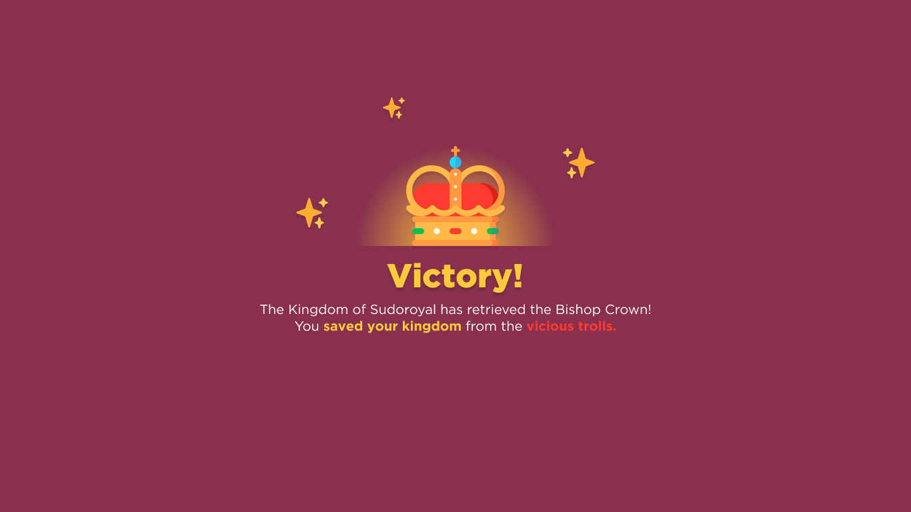

## Sudoroyal 👑
This is a royal-inspired Sudoku game implemented on C# and Python. *Play as King 9 or Queen 16 to save your kingdom from mischievous trolls!* This is a project for **CMSC 12 (Foundations of Computer Science).**

## Showcase ✨

**Figure 1. Title Screen**

**Figure 2. Gameplay**

**Figure 3. Victory Screen**

## Installation
1. Clone this repository.
2. Go to **Sudoroyal/Sudoroyal/bin/Debug/**
3. Open **Sudoroyal.exe**