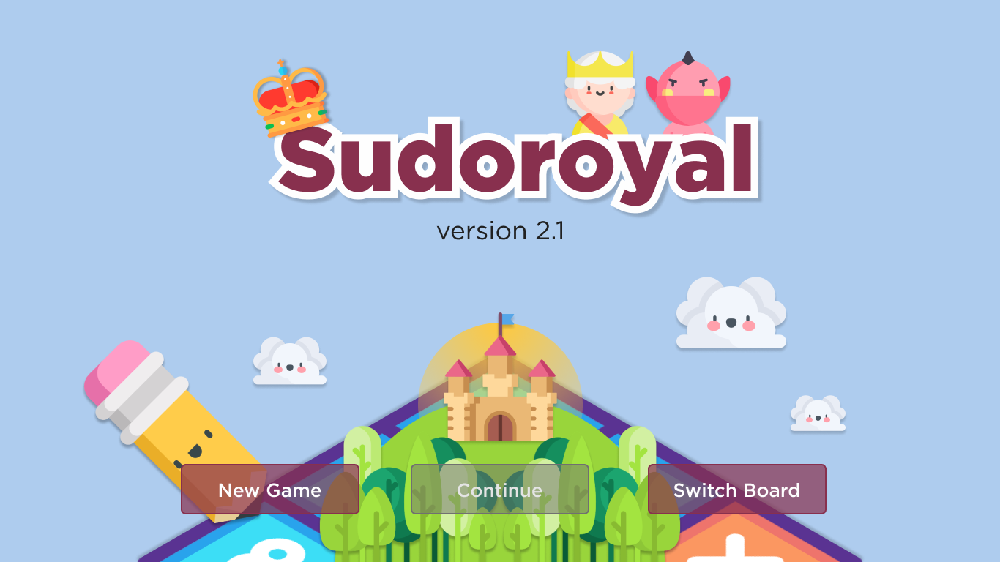
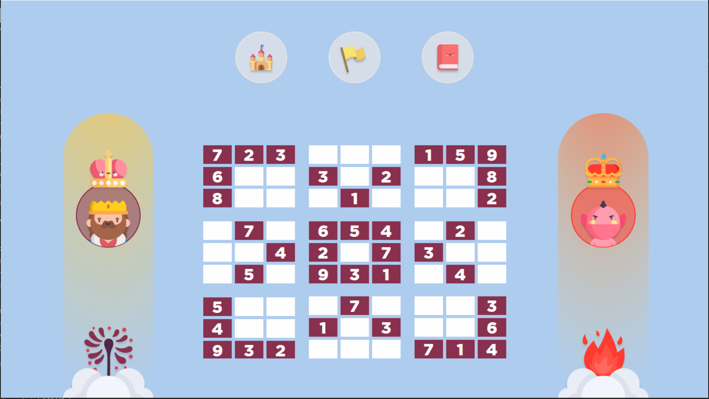

# Sudoroyal 👑
This is a royal-inspired game of Sudoku implemented on C# and Python. It consists of **6 boards**, which are of sizes **9x9** and **16x16**. Sudoroyal is my laboratory project for **CMSC 12 (Foundations of Computer Science)**.

## Preview 🔍

**Figure 1. Title Screen**

**Figure 2. Choose a character to play with by changing your Sudoku's size!**

**Figure 3. Game Screen (9x9 Board)**

## Game Lore 🏰
The Kingdom of Sudoroyal is **under attack** by trolls from **the Land of Abandonment,** as the Troll King captured the kingdom’s most sacred artifact - **the Bishop Crown!**

To get the crown back, the Troll King has challenged you, the leader of this kingdom, in a puzzle game. He has set **purple traps** across the board, and it’s your job **to complete the puzzle!**

## Project Setup ❤️
1. After cloning this respository, go to **Sudoroyal/Sudoroyal/bin/Debug/**
2. Open **Sudoroyal.exe**
