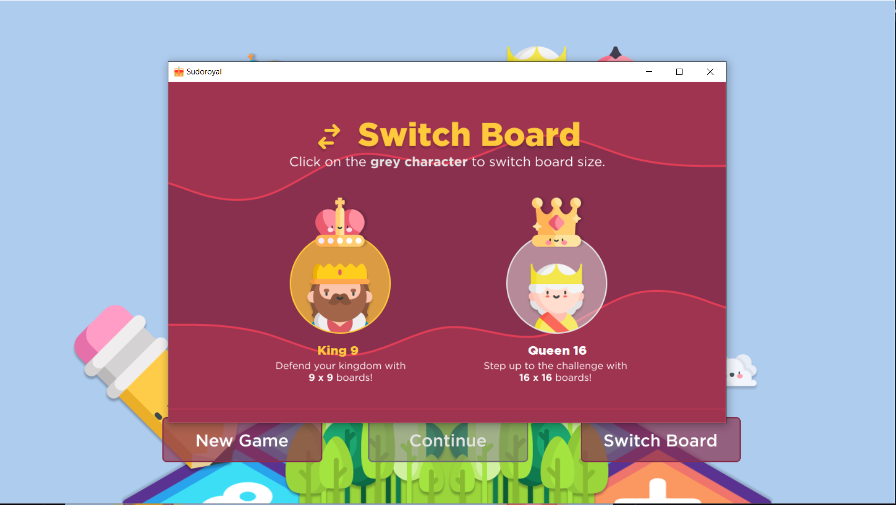

* * *
## Description 🏰
**Sudoroyal** is a royal-inspired game of Sudoku implemented using **C#** and **Python**. Play either as **King 9** or **Queen 16** to save your kingdom from the trolls! This is a laboratory project for **CMSC 12 (Foundations of Computer Science).**

## Specifications 🐱‍💻
- **Choose your difficulty! 🤯** Start your Sudoku journey with a 9x9 board or spice things up with a 16x16 one!
- **Your progress is autosaved. ❤️** Don't fear the trolls! You have nothing to worry because your answers are protected from their vicious mischief.
- **Your answer is checked every turn! 👌** After you answer a box, the game lets you know if your answer is unique among the numbers in its row, column, and box!

## Preview 🔎

**Figure 1. Title Screen.**

**Figure 2. Ready for a challenge? 🏁 Solve a 9x9 or 16x16 board!**

## Ready to play? 🧠 Get started!
1. After cloning this repository, go to **Sudoroyal/Sudoroyal/bin/Debug/**
2. Open **Sudoroyal.exe**
